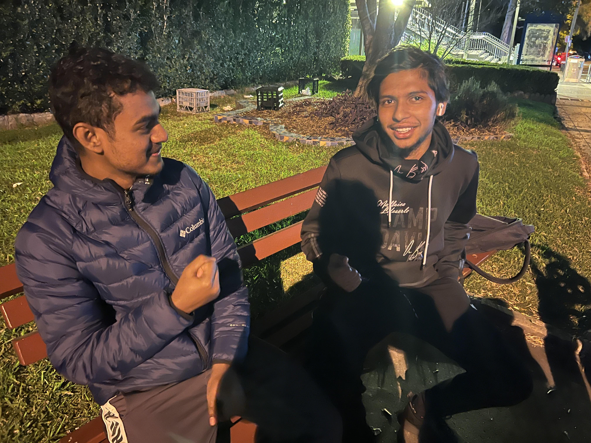
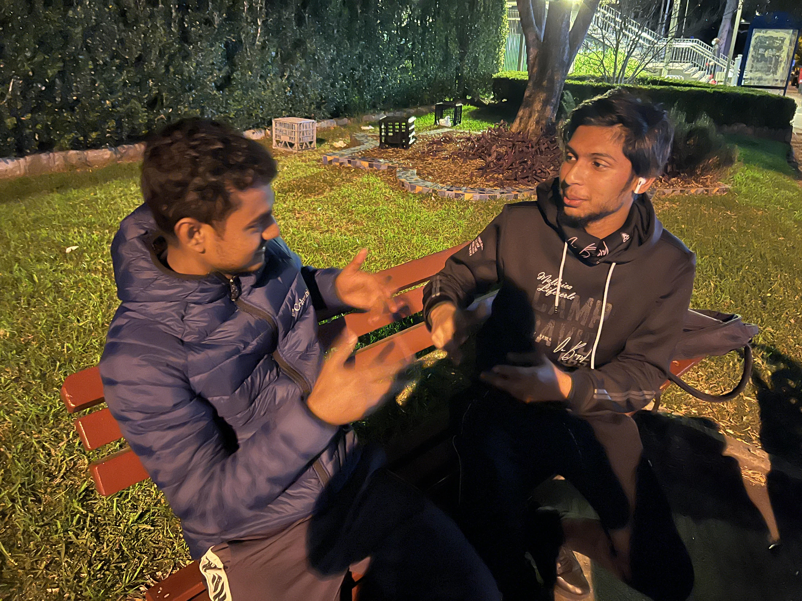
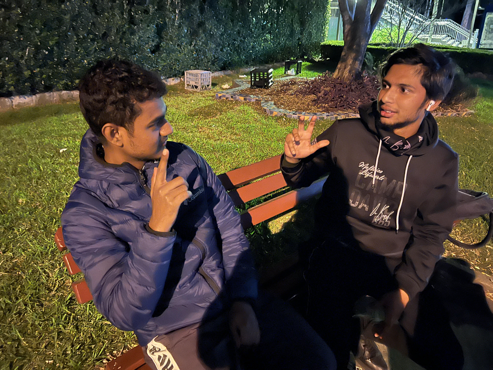

<html>
   <head>
     <h1> #ePortfolio <h1>
  </head>
  <body>
   <h3>1. Cmmunicational concepts and strategies.</h3>
    - Communication strategy is a plan to achieve communication objectives. This may apply to internal communications, marketing communications and public relations.
   <h3> 2. Show confidence and skills in oral communications and presentations.</h3>
     
   <h3>3. Work effectively as part of a team.</h3>
     
   <h3>4. Communicate effectively in a professional context.</h3>
    
 - Know where to communicate and about what.

    
 - Build your collaboration skills. 

     
- Talk face-to-face when you can.

     - Watch your body language and tone of voice
   <h3>5. Define and demonstrate conflict management and resolution strategies.</h3>
     
- Overcome conflict and reach resolutions

     
- Create value in the midst of disputes

     
- Negotiate with difficult people

     
- Determine whether to litigate, negotiate, or pursue both strategies simultaneously

     
     <h4>References: Google<h4>
   </body>
   </html>

